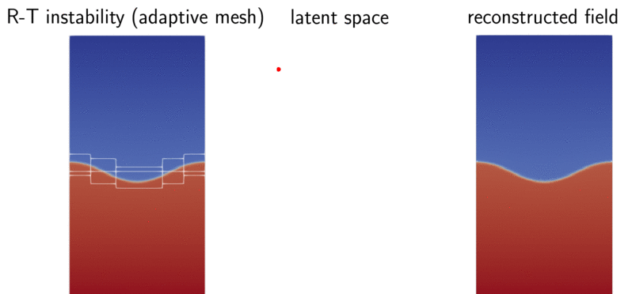

# Neural Implicit Flow

This is the repo for reproducing the results in our manuscript: [*Pan, Shaowu, Steven L. Brunton, and J. Nathan Kutz. "Neural Implicit Flow: a mesh-agnostic dimensionality reduction paradigm of spatio-temporal data." arXiv preprint arXiv:2204.03216 (2022)*](https://arxiv.org/abs/2204.03216). 

<p align="center">
  
</p>


## Table of Contents

* [Motivations](#motivations)
* [Getting Started](#getting-started)
  * [Prerequisites](#prerequisites)
* [Usage](#usage)
* [Roadmap](#roadmap)
* [Contributing](#contributing)
* [License](#license)
* [Contact](#contact)
* [Citation](#cite)


## Motivations

- **Fluids, governed by PDE, are expensive in terms of huge spatial discretization**
  - they are hard not just because they are nonlinear, but because solving them requires solving a typically very high-dimensional nonlinear dynamics.
  - control theory, optimization, uncertainty quantification is well developed/understood and computationally tractable in low-dimensional dynamics
  - this is why we need **dimensionality reduction (in space)**.

- **Existing state-of-the-art methods for dimensionality reduction are not really designed for fluid dynamics**
  - Proper Orthongonal Decomposition (POD) requires a fixed mesh for all parameters at all times, and it is linear. 
  - Convolutional Autoencoder (CAE) *downplays* fluid dynamics as images, while cubic memory scaling in 3D and multi-scale pheonomeon in the nature of turbulence limits the potential of such architecture for large-scale realistic flows. 
  - None of the above methods can be directly applied to adaptive mesh refinement data, which has been the state-of-the-art in many scientific computing community, (e.g., combustion simulation and computational astrophysics).
  
- **Key observation: parameter, time, space are not born equal**. 
	- we query space, tens of thousands times, more than time and parameter space.
	- a typical fluid dynamist/combustion engineer/aerodynamic engineers's task in analyzing spatial datasets is to heavily compute spatial-related quantity: spatial gradients, spatial average, total heat release, surface heat transfer, etc.

## Highlights
	
<p align="center">
  
</p>

- **We decouple spatial complexity (e.g., multi-scale), away from parametric complexity (e.g., bifurcations), and temporal complexity (chaos) to obtain a latent representation**
	
	- in this way, we follow the philosophy of manifold-based PDE learning, where one assumes there exists a magic low-dimensional manifold where the high-dimensional nonlinear dynamics can be effectively reconstructed on.
	
- **We borrow the idea of [DeepSDF](https://openaccess.thecvf.com/content_CVPR_2019/html/Park_DeepSDF_Learning_Continuous_Signed_Distance_Functions_for_Shape_Representation_CVPR_2019_paper.html) in Computer Graphics, which is designed for describing complex surfaces, to implicitly describes parametric spatial-temporal fields**
	- the difference lies in that we separate spatial complexity away from other factors, so it naturally induces two networks, ShapeNet (takes spatial as input) and ParameterNet (takes other factors as input), which, interestingly, falls under the concept of hypernetwork. 
	- the weights and biases of ShapeNet is just the output of ParameterNet, which means the only trainable variables of the whole framework are in the ParameterNet.

- **By varying the level of parameterization, we can learn a mesh-agnostic linear representation of the spatial-temporal field**
	- just parameterize the last linear layer of ShapeNet, we explicitly decouple time and space.
	- with the help of this idea, we performed DMD analysis on a AMR datasets, for the very first time.

- **We leverage [SIREN](https://proceedings.neurips.cc/paper/2020/hash/53c04118df112c13a8c34b38343b9c10-Abstract.html) to alleviate the problem of spectral-bias**
	- turbulence are multi-scale, which makes standard MLP fail to capture small wavenumbers. 
	
	- we use SIREN in the ShapeNet

	- we obtained a compressed representation for a 3D homogeneous isotropic turbulence dataset with over 2 million cells, for the first time
	- with the help of a sensor-based autoencoder, we obtained encodes Rayleigh-Taylor instability directly from an AMR solver for the first time, outperforming POD and CNN.
	
- **Since there are infinite number of latent representations, we regularize the Jacobian and approximated Hessian of the encoder to prefer a smoother low-dimensional manifold**

- **Sparse sensing with NIF**
	- We combine POD-QDEIM for sensor placement and NIF for learning spatial-temporal fields
	- For the Sea Surface Temperature data, NIF-based framework significantly outperforms the best model from POD-QDEIM in predicting unseen testing data.


## Getting Started

### Prerequisites
- python3
- scipy
- numpy
- netCDF4
- [filprofiler](https://github.com/pythonspeed/filprofiler)
- tensorflow 2

### Data and pre-existing trained models

Since we are working with PDE, the data is huge (around 37GB) and stored here in my [Box Drive](https://rpi.box.com/s/vbuz65zdt23rnhxipd68pwdwv70nl630). Please follow the `README.md` file inside.


<!-- USAGE EXAMPLES -->
## Reproducing the results

To reproduce the corresponding section in our paper, **please first download the full data in the above section**. Then you can follow the instructions in each link below:

[Section 2: compare with deeponet](https://github.com/pswpswpsw/paper-nif/tree/main/sec_2_Compare_with_deeponet)

[Section 3.1: Data-fit surrogate modeling](https://github.com/pswpswpsw/paper-nif/tree/main/sec_3_1_Data_fit_Surrogate-modeling)

[Section 3.2: Mesh-agnostic Autoencoder on AMR](https://github.com/pswpswpsw/paper-nif/tree/main/sec_3_2_Better_compression_vs_cnn_pod)

[Section 3.3 and 3.4: Mesh-agnostic dimension reduction for 3D turbulence](https://github.com/pswpswpsw/paper-nif/tree/main/sec_3_3and4_Mesh-agnostic-dimension-reduction-3d-turbulence)

[Section 3.5: Mesh-agnostic linear representation](https://github.com/pswpswpsw/paper-nif/tree/main/sec_3_5_Mesh-agnostic-linear-subspace)

[Section 3.6: Sparse sensing on sea surface temperature data](https://github.com/pswpswpsw/paper-nif/tree/main/sec_3_6_Sparse_Sensing_SST)


<!-- CONTRIBUTING -->
## Contributing

Contributions are what make the open source community such an amazing place to be learn, inspire, and create. Any contributions you make are **greatly appreciated**.

1. Fork the Project
2. Create your Feature Branch (`git checkout -b feature/AmazingFeature`)
3. Commit your Changes (`git commit -m 'Add some AmazingFeature'`)
4. Push to the Branch (`git push origin feature/AmazingFeature`)
5. Open a Pull Request


<!-- LICENSE -->
## License

Distributed under the MIT License. See `LICENSE` for more information.


## FAQ

**Q: Why there is another NIF package on Github from you?**

A: I believe it is easier to learn how it works in a nut-shell, with a **single, self-contained Python script**, instead of going to **maze** of a package. You will find that codes in each application are fully independent.


<!-- CONTACT -->
## Contact

Shaowu Pan - email: shawnpan@uw.edu

## Citation

```
@article{pan2022neural,
  title={Neural Implicit Flow: a mesh-agnostic dimensionality reduction paradigm of spatio-temporal data},
  author={Pan, Shaowu and Brunton, Steven L and Kutz, J Nathan},
  journal={arXiv preprint arXiv:2204.03216},
  year={2022}
}
```
